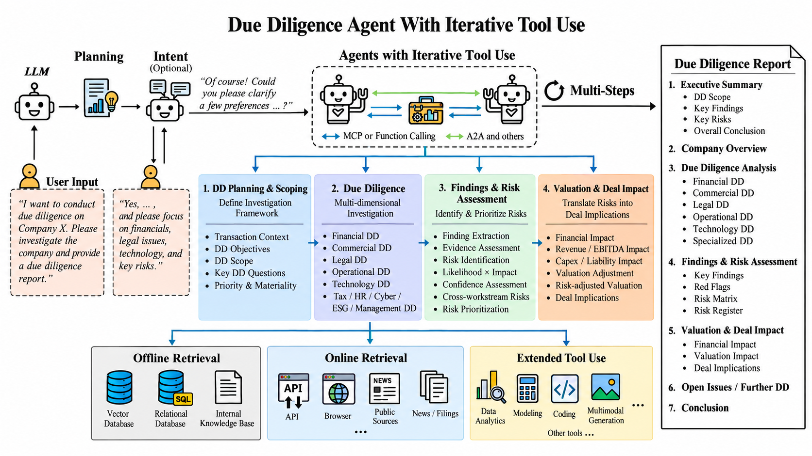

# Due Diligence Agent

A Deep Research agent for conducting corporate due diligence, covering due diligence planning, multi-dimensional investigation, findings and risk assessment, valuation and deal impact analysis, and report generation.

The agent supports OpenAI, OpenRouter, Gemini, and Perplexity Deep Research providers. It takes a target company, research cut-off date, and optional additional context at runtime and produces a structured, evidence-based due diligence report.

## Agent Workflow



## Quick Start

Create and activate a virtual environment:

```powershell
python -m venv .venv
.venv\Scripts\activate
```

Install dependencies:

```powershell
pip install -r requirements.txt
```

Run the agent:

```powershell
python -m runtime.main
```

The runtime will prompt for:

- Target Company
- Research Cut-off Date
- Additional Context (optional)
- Deep Research Provider
- Model, where applicable
- API Key

## Outputs

Research outputs are saved to the `output/` directory.

The agent generates:

- Markdown due diligence report
- DOCX due diligence report
- PDF due diligence report
- Evidence JSON containing structured citations, sources, and provider metadata

The final report follows a professional due diligence structure, including company overview, workstream analysis, key findings, integrated risk assessment, valuation and deal impact, open issues, and supporting evidence.

> PDF generation requires Microsoft Word on Windows. If PDF conversion fails, the completed Markdown, Evidence JSON, and available DOCX outputs are still preserved.
